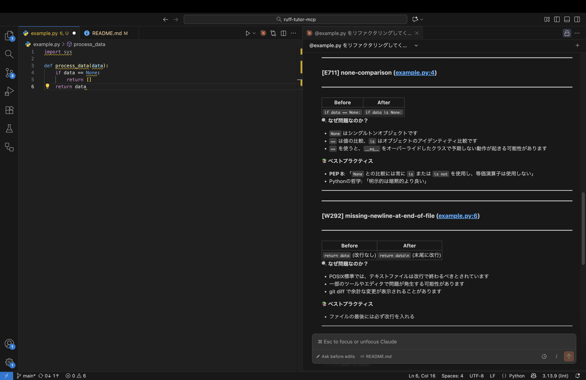

# Ruff Tutor MCP

**Ruff violations as learning opportunities, not just auto-fixes**


## 概要

Pythonの静的解析ツール [Ruff](https://docs.astral.sh/ruff/) を利用し、コードの品質向上とエンジニアのスキルアップを両立させるための [Model Context Protocol (MCP)](https://modelcontextprotocol.io/) サーバーです。

## 背景と目的

AIによるコーディング支援（Claude Code等）は強力ですが、静的解析ツールによる指摘事項が自動修正される過程で、「なぜその書き方が推奨されないのか」「正しいPythonの流儀（Pythonic）とは何か」を学ぶ機会が失われがちです。

本ツールは、単なる自動修正機能ではなく、「指摘内容の背景（[PEP](https://peps.python.org/)や設計原則）を理解した上で修正する」というプロセスをワークフローに組み込むために開発されました。

## 特徴
- 📚 **教育的なフィードバック**: エラー検知時に、修正コードだけでなく、該当するルールの詳細・PEPへの参照・なぜそれが問題なのかという背景情報を提示します。
- 🎯 **段階的な学習モード**: ユーザーの習熟度や状況に合わせて、情報の提示方法をコントロール可能です（[詳細](#学習モード)）。
- 🧠 **確実な知識定着**: 安易な自動修正を防ぎ、必要に応じてユーザー自身の修正を促すことで、記憶への定着を図ります。

## セットアップ

### Claude Code

```bash
claude mcp add ruff-tutor -- uvx --from git+https://github.com/223mle/ruff-tutor-mcp ruff-tutor-mcp
```

### Claude Desktop

`~/Library/Application Support/Claude/claude_desktop_config.json` (macOS) または `%APPDATA%\Claude\claude_desktop_config.json` (Windows) に以下を追加:

```json
{
  "mcpServers": {
    "ruff-tutor": {
      "command": "uvx",
      "args": [
        "--from",
        "git+https://github.com/223mle/ruff-tutor-mcp",
        "ruff-tutor-mcp"
      ]
    }
  }
}
```

### 学習モード

| モード | 説明 |
|--------|------|
| **beginner** | 修正前/修正後のコード例を表示し、詳しい説明付きでユーザーに修正を促す |
| **advanced** | コード例を表示せず、説明のみでユーザー自身に考えさせる |
| **auto** | 説明を表示した後、自動修正を実行（デフォルト） |

### 設定ファイル（オプション）

プロジェクトルートに `.ruff-tutor.toml` を配置することで、デフォルトの動作をカスタマイズできます。

```toml
# .ruff-tutor.toml
mode = "auto"  # "beginner", "advanced", "auto"
max_retry = 2      # advanced モードでの最大リトライ回数 (1-10)
```

## 使用例

Claude Codeを起動し、MCP接続後、以下のように依頼します:

```markdown
@xxx.py をリファクタリングしてください。
```

以下のような形式で結果が表示されます:

---