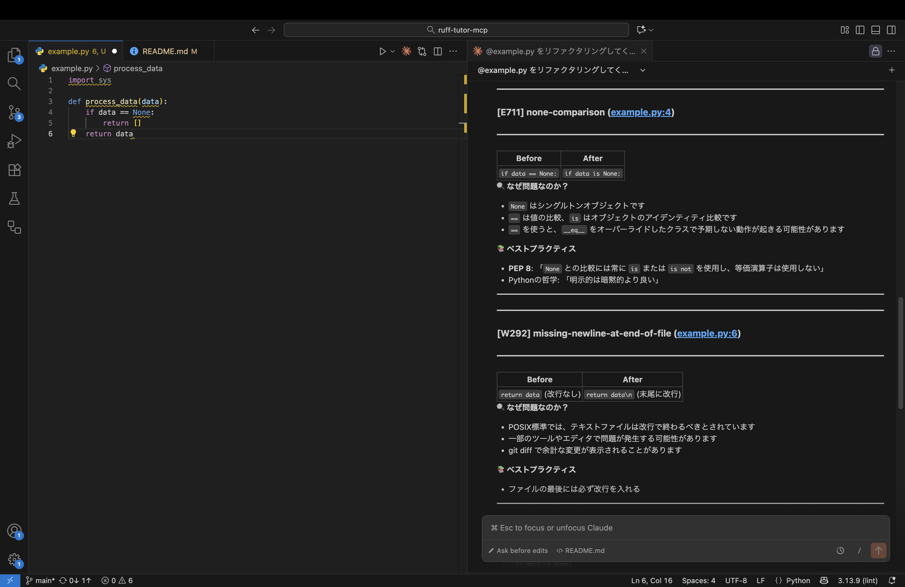

# Ruff Tutor MCP

**Ruff の指摘を「自動修正して終わり」にせず、学習の機会に変える MCP サーバー**


## 概要

Python の静的解析ツール [Ruff](https://docs.astral.sh/ruff/) の検査結果に、ルールの解説・修正前後のコード例・AI への指導方針を添えて返す [Model Context Protocol (MCP)](https://modelcontextprotocol.io/) サーバーです。Claude Code などの AI コーディングツールに接続すると、AI が「コードを直すツール」から「Python の書き方を教えるチューター」に変わります。

AI コーディング支援では、静的解析の指摘が自動修正される過程で「なぜその書き方が推奨されないのか」を学ぶ機会が失われがちです。本ツールは、指摘の背景（[PEP](https://peps.python.org/) や設計原則）を理解した上で、ユーザー自身が修正するというプロセスをワークフローに組み込みます。

## 特徴

- 📚 **教育的なフィードバック**: 違反ごとに、ルールの1行要約・修正前後のコード例・PEP への参照を返します。詳しい解説は AI が必要と判断したルールだけオンデマンドで取得するため、違反が多いコードでも応答が肥大化しません。
- 🎯 **3つの学習モード**: 習熟度に合わせて、コード例の見せ方と修正の主体を切り替えられます（[学習モード](#学習モード)）。
- 🧠 **サーバー管理の学習セッション**: beginner / advanced モードでは、「どの違反を直せたか・何が残っているか・修正で新しい違反が生まれていないか」をサーバーが照合して判定します。挑戦回数もサーバーが数え、上限に達したときだけ正解を開示します。
- 🔒 **答えの漏洩を構造的に防止**: advanced モードでは修正例のデータ自体を AI に渡しません。「答えを見せないで」と AI にお願いする方式ではないため、確実に隠せます。

## 学習モード

| モード | 修正コード例 | 修正する人 | 動き |
|--------|:---:|:---:|------|
| **auto**（デフォルト） | 見せる | AI | 解説を表示した後、AI が自動修正する |
| **beginner** | 見せる | ユーザー | Before/After と解説を見ながら、ユーザーが自分で修正する |
| **advanced** | 見せない | ユーザー | 解説だけを頼りに、修正方法をユーザーが自分で考える |

beginner / advanced モードは学習セッションとして進みます。

1. AI が違反を解説し、ユーザーに修正を促す
2. ユーザーがコードを修正する
3. AI がサーバーに検証を依頼し、「直せた違反 / 残っている違反 / 新たに発生した違反」の判定が返る
4. 違反が残っていれば再挑戦する。`max_retry` 回（デフォルト2回）挑戦しても残っている場合は、正解の Before/After が開示される

## セットアップ

対象プロジェクトに Ruff をインストールする必要はありません。サーバーに同梱された Ruff が使われ、プロジェクトの `pyproject.toml` / `ruff.toml` の設定はそのまま尊重されます。

### Claude Code

```bash
claude mcp add ruff-tutor -- uvx --from git+https://github.com/223mle/ruff-tutor-mcp ruff-tutor-mcp
```

### Claude Desktop

`~/Library/Application Support/Claude/claude_desktop_config.json`（macOS）または `%APPDATA%\Claude\claude_desktop_config.json`（Windows）に以下を追加します。

```json
{
  "mcpServers": {
    "ruff-tutor": {
      "command": "uvx",
      "args": [
        "--from",
        "git+https://github.com/223mle/ruff-tutor-mcp",
        "ruff-tutor-mcp"
      ]
    }
  }
}
```

## 使い方

MCP 接続後、Claude に次のように依頼します。

```markdown
@xxx.py を ruff-tutor でレビューしてください。beginner モードでお願いします。
```



### 設定ファイル（オプション）

プロジェクトルートに `.ruff-tutor.toml` を置くと、モード指定を毎回書かずに済みます。

```toml
# .ruff-tutor.toml
mode = "beginner"  # "auto", "beginner", "advanced"
max_retry = 2      # 学習セッションでの最大挑戦回数 (1-10)
```

設定の優先順位は、AI への依頼文でのモード指定 → `.ruff-tutor.toml` → デフォルト（auto）です。

## 提供ツール

AI が状況に応じて呼び分ける4つのツールを公開しています。

| ツール | 役割 |
|--------|------|
| `review_code(path, mode)` | Ruff で検査し、ルール別にまとめた教材を返す。beginner / advanced では学習セッションを開始し `session_id` を発行する |
| `check_my_fix(session_id)` | 再検査して「直せた / 残っている / 新規」の違反を判定する。挑戦回数はサーバーが管理する |
| `explain_rule(code)` | ルールの詳しい解説（背景・具体例つき）を返す。結果はプロセス内にキャッシュされる |
| `end_session(session_id)` | セッションを閉じ、直せた違反数と学んだルールの一覧を返す |

## 開発

```bash
git clone https://github.com/223mle/ruff-tutor-mcp
cd ruff-tutor-mcp
uv sync

uv run pytest tests/            # テスト
uv run ruff check src/ tests/   # リント
uv run mypy src/                # 型チェック
```

## ライセンス

MIT
